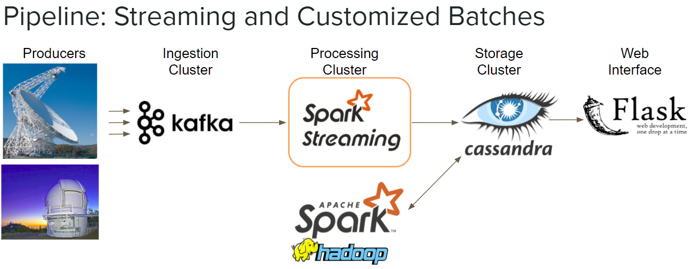

# SETI Streaming Detection of Anomalous Signals
Insight Data Engineering Fellow September 2017

Over three weeks, I built a streaming anomalous signal detection pipeline for high level SETI signal data. 
SETI is the organization that searches for extraterrestrial signals. 

Stream processing is motivated by the value that repeated observations of anomalous signals can bring. 
Real-time notifications would give researchers the option to immediately re-measure stars that have been identified as anomalous. 
SETI is looking for a needle in a haystack, and if they observe a very interesting needle-like signal, it is of great value to immediately re-measuring that anomaly within the same night. 

To this end, I built a streaming pipeline to ingest with Kafka high-level signal data from observatory producers, to identify anomalous signals with Spark Streaming, and to save results in a Cassandra database that can be queried through my Flask web interface, which also has realtime notification of anomalous signals. 
Customized Spark batch processing scripts can also be applied to the data stored in Cassandra. 
Efficent distributed processing is important for these use cases.

The high-level signal data looks something like this: Each observation of a star has many signals and each signal has many properties.
To be considered anomalous, a signal must first exceed simple threshold filters on Property2 and Property3.
Then, to filter out earth-originating signals, signals must be a member of all observations when the telescope is pointed directly ON the a star or galaxy, but not a member of any of the observations when the telescope is pointed OFF of the star. 
This second criteria involves matching signals between different observations.

To imagine this challenge, consider matching properties that are +/- 1 units of one another between to two observation lists.
Using the default join in scala, each element of the first list will be compared with each element of the second list, cartesian pairwise style, which is a slow N^2 operation when there are millions of rows in each list.
I implemented a more efficient range-join using a bucketing trick, where elements from each list are bucketed and elements are only joined with items within each bucket.
I measured this to be 300 times faster for range-joining two observations with a million items each.
To put that in perspective, a join that would take over two days to run, takes 10 minutes. 

Matching signals is even more difficult when you want to match based on multiple property values.
For example, when you join based on if two sets of properties are within 1 unit distance of each other, the bucketing trick in the previous image does not directly apply. 
So, I implemented a probabilistic hashing trick to make the join tractable. (I used a Locality Sensitive Hashing and bucketed random projection for Euclidian distance method, where similar signals are bucketed into the same bucket with high probability, and joins are only performed on signals found within the same bucket.)
However, this approach has a trade-off between speed and accuracy. 

These joining techniques are broadly applicable to many industry applications. (e.g., matching customers lists by their multi-dimensional properties similarity.)

I created two web pages:
The first allows one to input values to query my database (https://tinyurl.com/SETIqueries).

The second web page updates periodically displaying newly identified anomalous signals in real-time within minutes, notifying if any stars are worth immediately remeasuring within the same night. (https://tinyurl.com/SETIrealtime)

Slides for this project are available at: https://tinyurl.com/SETIslides
